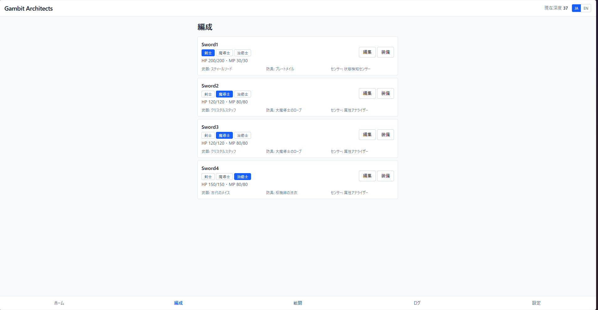
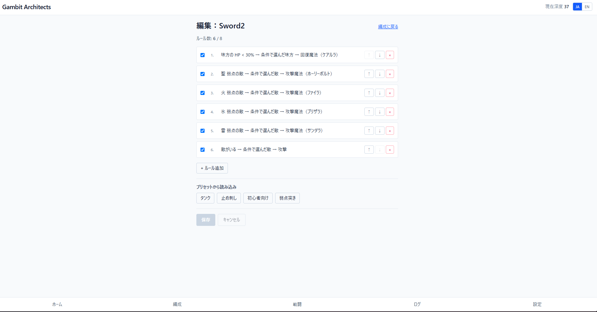
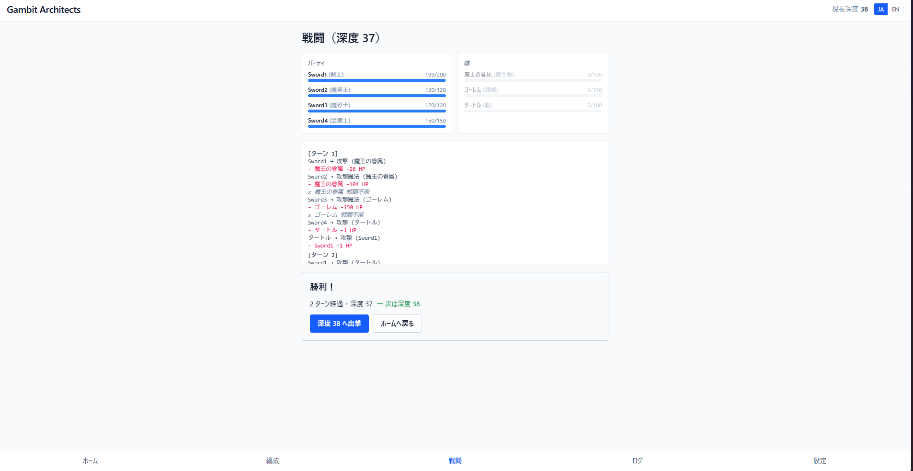

# Gambit Architects

[](docs/m3_checklist.md)
[-blue)](package.json)
[](LICENSE)

> 条件 → 対象 → 行動のルールを組んで、AI 同士に戦わせる。
> FF12 のガンビットを"主役"に据えた、Web ベースのオートバトル × プログラミング・サンドボックス。

**プレイ → [itch.io](#) | [Cloudflare Pages](#)**（M4-D/E で公開予定）

---

## 日本語版

### コンセプト

プレイヤーは"操作"しない。AI アーキテクトとして **条件 → 対象 → 行動** のルールを組み、自動戦闘を見守る。

```
出撃 → 自動戦闘 → ログ確認 → ガンビット編集 → 再挑戦
```

procgen ダンジョンを深く潜るほど、敵の弱点・耐性・状態異常を読み解いてガンビットを磨く必要が出てくる。

### 主な特徴

- **3 ジョブ × 4 体パーティ**：剣士・魔導士・治癒士の組み合わせ自由
- **22 種の装備**：武器 9 + 防具 9 + センサー 4（センサー精度でガンビット成功率が変わる）
- **15 ボス + 通常敵 15 種**：聖弱点・闇耐性・物理半減など 14 種の状態異常 / 耐性
- **21 条件 × 15 行動**：ガンビット DSL v0.3 完備（FF12 風の細かい条件分岐）
- **日本語 / 英語切替**：UI、ジョブ名、敵名、装備、戦闘ログまで全部
- **PWA 対応**：ホーム画面に追加してオフラインプレイ可能
- **サーバ不使用**：データは localStorage のみ。広告・課金なし、完全無料

### スクリーンショット

| 編成画面 | ガンビット編集 | 戦闘画面 |
| :---: | :---: | :---: |
|  |  |  |

（M4-C で実機スクリーンショットに差し替え予定）

### ローカル起動

```sh
pnpm install        # 依存関係のインストール（初回のみ）
pnpm test           # 全テスト実行（272 件）
pnpm dev            # → http://localhost:5173/
pnpm build          # 本番ビルド（dist/）
```

Node.js 24 LTS / pnpm が必要。Volta を使うと自動で揃います。

### 技術スタック

- **言語**：TypeScript 6
- **UI**：React 19 + React Router 7
- **ビルド**：Vite 8 + Tailwind v4 + vite-plugin-pwa
- **テスト**：Vitest 4 + Testing Library + jsdom（272 件）
- **永続化**：localStorage（マイグレーション対応）
- **配信**：Cloudflare Pages + itch.io

### ドキュメント

- [企画書](docs/gambit_game_planning_doc.md) — プロジェクト全体像と v1.0 凍結ライン
- [ガンビット DSL 仕様 v0.3](docs/gambit_dsl_spec.md) — 条件 21・行動 15・対象 6
- [M3 完了チェックリスト](docs/m3_checklist.md) — コンテンツ拡充の到達点
- [M3 振り返り](devlog/m3_retro.md) — 5 週間の苦戦ポイントと学び
- [M4 計画書](docs/m4_checklist.md) — MVP 公開フェーズの計画
- [手動デモ手順](docs/m3_demo_checklist.md) — 20〜30 分で一周検証
- [`CLAUDE.md`](CLAUDE.md) — AI 開発パートナーへの前提情報

### 開発フィードバック

バグ報告・要望は [GitHub Issues](https://github.com/sakanoshota-ops/gambit-architects/issues) か、
ゲーム内の「設定 → フィードバック」から送れます。

### ライセンス

MIT License（コード）。ゲーム内のアセット（アイコン・テキスト等）も MIT で配布。

---

## English

### Concept

You don't "play"—you're an AI architect. Compose rules in **Condition → Target → Action** form, then watch your party fight automatically.

```
Sortie → Auto-Battle → Read Log → Edit Gambit → Retry
```

The deeper you go in the procgen dungeon, the more carefully you need to read enemies' weaknesses, resistances, and status effects to refine your gambit rules.

### Highlights

- **3 jobs × 4-character party**: Swordsman, Mage, Healer in any combination
- **22 equipment pieces**: 9 weapons + 9 armor + 4 sensors (sensor accuracy gates condition reliability)
- **15 bosses + 15 regular enemies**: Holy weakness, dark resistance, physical halving, 14 statuses
- **21 conditions × 15 actions**: Full DSL v0.3 (FF12-style fine-grained logic)
- **Japanese / English toggle**: UI, job names, enemies, equipment, battle log—everything
- **PWA-ready**: Install to home screen, play offline
- **No server**: Saves in localStorage only. No ads, no monetization, free forever

### Screenshots

| Party | Gambit Editor | Battle |
| :---: | :---: | :---: |
|  |  |  |

(Will be replaced with actual game shots in M4-C)

### Run Locally

```sh
pnpm install
pnpm test        # 272 tests
pnpm dev         # → http://localhost:5173/
pnpm build       # → dist/
```

Requires Node.js 24 LTS and pnpm. Volta auto-installs both.

### Tech Stack

- **Language**: TypeScript 6
- **UI**: React 19 + React Router 7
- **Build**: Vite 8 + Tailwind v4 + vite-plugin-pwa
- **Test**: Vitest 4 + Testing Library + jsdom (272 tests)
- **Storage**: localStorage (with migration)
- **Hosting**: Cloudflare Pages + itch.io

### Feedback

Bug reports and feature requests are welcome via
[GitHub Issues](https://github.com/sakanoshota-ops/gambit-architects/issues),
or from in-game "Settings → Feedback".

### License

MIT License (code). Assets (icons, text) also under MIT.

---

## Roadmap

| Milestone | Status | Description |
| --- | --- | --- |
| M1 | ✅ | Core verification (gambit evaluator, minimal battle loop, 1 job) |
| M2 | ✅ | Playable (UI, gambit editor, 3 jobs, 5 enemies, depth 1–5) |
| M3 | ✅ | Content expansion (equipment, sensors, 15 enemies, 4 bosses, resistances, i18n) |
| **M4** | 🚧 | **MVP launch** (itch.io, Cloudflare Pages, PWA, feedback) |
| M5 | 📋 | Polish (UX, balance, ATB consideration, mobile optimization) |
| M6 | 📋 | v1.0 (sharing, preset bundles, final balance) |

### v1.0 Scope (Frozen)

- 3 jobs (Swordsman / Mage / Healer)
- 4-character party
- 21 conditions, 15 actions, 6 target types
- AND-only logic (OR is v1.1+)
- 8 rule slots per character
- 15–20 enemy templates
- 4–5 bosses
- 6 screens (Home / Party / Gambit Editor / Battle / Log / Settings)
- Japanese + English only

### Not in v1.0

- Online ranking, leaderboards, friends
- Monetization (ads, IAP)
- Cinematic story, voice acting
- Job #4 and beyond
- Node-based gambit editor (vertical list only)
- Native store distribution
- Languages beyond JP / EN

---

*Built with [Claude](https://www.anthropic.com/claude) as AI development partner.*
